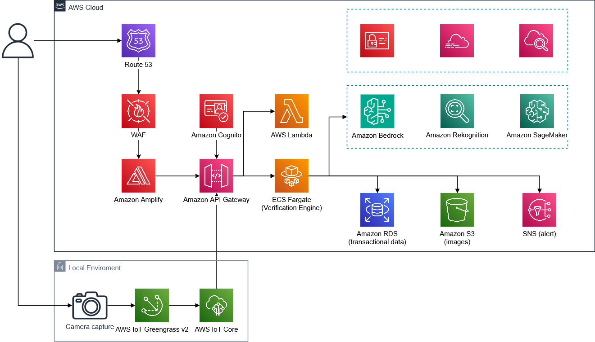

# OrderLens — Retail Verification Suite

AI-powered tray verification and POS management system built with Next.js 14, TypeScript, and Tailwind CSS.

## Project Structure

```
src/
├── app/
│   ├── login/                    # Page 1: Login screen
│   ├── pos-terminal/             # Page 2: POS product catalog + order builder
│   ├── pos-tray-verification/    # Page 3: MAIN — AI tray verification (command center)
│   ├── tray-audit/               # Page 4: Audit log with detail panel
│   ├── transaction-history/      # Page 5: Full transaction table with tabs
│   ├── operational-insights/     # Page 6: Analytics dashboard (KPIs, charts, alerts)
│   ├── api/
│   │   └── verify-tray/
│   │       └── route.ts          # API: Claude Vision tray verification endpoint
│   ├── globals.css
│   └── layout.tsx
├── components/
│   ├── AppShell.tsx              # Layout wrapper (TopBar + SideNav + main)
│   ├── TopBar.tsx                # Sticky header with nav + search
│   └── SideNav.tsx               # Left sidebar with active-state navigation
└── lib/
    └── types.ts                  # Shared types, MENU_CATALOG, DEMO_ORDERS, compareOrder()
```

## Pages

| Route | Description |
|-------|-------------|
| `/login` | Auth page with branding, credential form |
| `/pos-terminal` | POS product grid + live cart sidebar |
| `/pos-tray-verification` | **MAIN** — 3-column: order builder / tray camera / AI results |
| `/tray-audit` | Audit log list with expandable detail panel |
| `/transaction-history` | Full table with tabbed filters + pagination |
| `/operational-insights` | KPI cards, line chart, flagged heatmap, per-item accuracy |

## Getting Started

### 1. Install dependencies

```bash
npm install
```

### 2. Configure environment

```bash
cp .env.local.example .env.local
```

Edit `.env.local` and set your Anthropic API key:

```
ANTHROPIC_API_KEY=sk-ant-...
```

### 3. Run development server

```bash
npm run dev
```

Open [http://localhost:3000](http://localhost:3000) — it redirects to `/login`.

## API: Verify Tray

**POST** `/api/verify-tray`

**Request body:**
```json
{
  "expectedOrder": {
    "orderId": "ORD-001",
    "items": [
      { "productId": "snack_red", "name": "Snack Red", "quantity": 2 }
    ]
  },
  "menuCatalog": [...],
  "imageBase64": "data:image/jpeg;base64,..."
}
```

**Response:**
```json
{
  "success": true,
  "detectedItems": [
    { "productId": "snack_red", "productName": "Snack Red", "quantity": 2 }
  ],
  "notes": []
}
```

The route uses **Claude claude-opus-4-5** (vision) via Anthropic API. The frontend then re-runs a deterministic `compareOrder()` locally to produce `missingItems`, `extraItems`, and `quantityMismatches`.

## Design System

The UI follows the **OrderLens** design language from your uploaded mockups:

- **Colors**: Material You token palette (primary `#0058be`, surface `#f8f9fa`, error `#ba1a1a`, etc.)
- **Font**: Inter (headline, body, label)
- **Border radius**: Compact — `0.125rem` default, `full` = `0.75rem`
- **Gradient**: `velocity-gradient` → `135deg, #0058be → #2170e4`
- **Icons**: Google Material Symbols Outlined

## Demo Mode

On the `/pos-tray-verification` page, use the **Demo Controls** bar to:
- Load `Demo A` (Matched), `Demo B` (Missing item), or `Demo C` (Extra item) as the expected order
- Upload any tray photo — the AI will try to detect items against the catalog

## Tech Stack

- **Next.js 14** (App Router)
- **TypeScript**
- **Tailwind CSS** (custom token palette matching the design)
- **Anthropic API** (`claude-opus-4-5` vision model)
- **Google Material Symbols** icons
